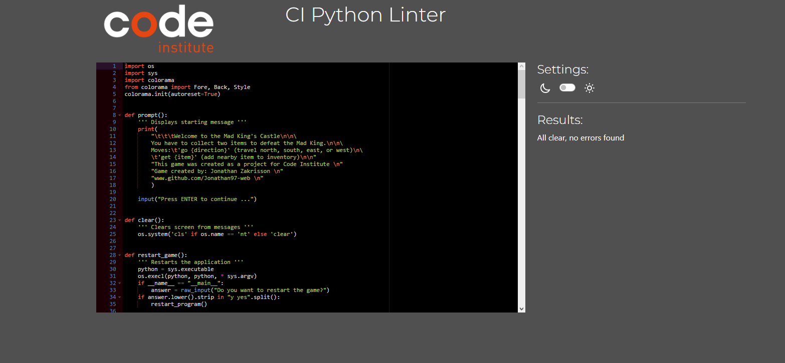

# Testing

Return back to the [README.md](README.md) file.

## Code Validation
### Python

I have used the recommended [CI Python Linter](https://pep8ci.herokuapp.com) to validate all of my Python files.

| File | CI URL | Screenshot | Notes |
| --- | --- | --- | --- |
| run.py | [CI PEP8](https://pep8ci.herokuapp.com/https://raw.githubusercontent.com/Jonathan97-web/mad-king/main/run.py) |  | All clear, no errors found. |
## Lighthouse Audit

⚠️⚠️⚠️⚠️⚠️ START OF NOTES (to be deleted) ⚠️⚠️⚠️⚠️⚠️

Use this space to discuss testing the live/deployed site's Lighthouse Audit reports.
Avoid testing the local version (especially if developing in Gitpod), as this can have knock-on effects of performance.

If you don't have Lighthouse in your Developer Tools,
it can be added as an [extension](https://chrome.google.com/webstore/detail/lighthouse/blipmdconlkpinefehnmjammfjpmpbjk).

Don't just test the home page (unless it's a single-page application).
Make sure to test the Lighthouse Audit results for all of your pages.

**IMPORTANT**: You must provide screenshots of the results, to "prove" that you've actually tested them.

Sample Lighthouse testing documentation:

🛑🛑🛑🛑🛑 END OF NOTES (to be deleted) 🛑🛑🛑🛑🛑

I've tested my deployed project using the Lighthouse Audit tool to check for any major issues.

| Page | Size | Screenshot | Notes |
| --- | --- | --- | --- |
| Home | Mobile |  | Some minor warnings |
| Home | Desktop |  | Few warnings |
| About | Mobile |  | Some minor warnings |
| About | Desktop |  | Few warnings |
| Gallery | Mobile |  | Slow response time due to large images |
| Gallery | Desktop |  | Slow response time due to large images |
| x | x | x | repeat for any other tested pages/sizes |

## Defensive Programming

PP3 (Python-only):
- Users must enter a valid letter/word/string when prompted otherwise one of the things underneath will happen.
    - You cannot enter anything other than directions (North, West, East or South) or Get (item).
    - You cannot break anything by writing any special characters (!*"#%).
    - You cannot break anything by writing the wrong words.
    - If you write "Go" somewhere that is not the directions you will get a "You cannot go that way" message.
    - If you write "Get" on a non existent item you will get a "Cannot get (item)" message.
    - If you write something else that is not a command you will get an "Invalid command" message.
- The application has been tester numerous times to ensure that the user cannot break it by inputting the wrong commands.

## Unfixed Bugs

There are no remaining bugs that I am aware of.