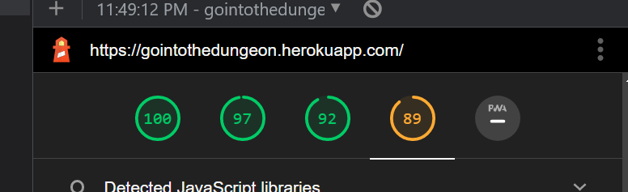
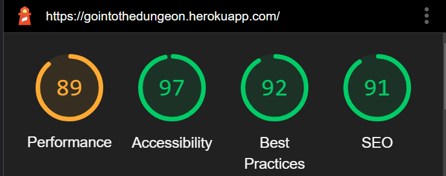

# Testing

Return back to the [README.md](README.md) file.

## Code Validation
### Python

I have used the recommended [CI Python Linter](https://pep8ci.herokuapp.com) to validate all of my Python files.

| File | CI URL | Screenshot | Notes |
| --- | --- | --- | --- |
| run.py | [CI PEP8](https://pep8ci.herokuapp.com/https://raw.githubusercontent.com/Jonathan97-web/mad-king/main/run.py) |  | All clear, no errors found. |

## Lighthouse Audit

I've tested my deployed project using the Lighthouse Audit tool to check for any major issues.

| Page | Size | Screenshot | Notes |
| --- | --- | --- | --- |
| Home | Desktop |  | Few warnings |
| Home | Mobile |  | Few warnings |

## Defensive Programming

PP3 (Python-only):
- Users must enter a valid letter/word/string when prompted otherwise one of the things underneath will happen.
    - You cannot enter anything other than directions (North, West, East or South) or Get (item).
    - You cannot break anything by writing any special characters (!*"#%).
    - You cannot break anything by writing the wrong words.
    - If you write "Go" somewhere that is not the directions you will get a "You cannot go that way" message.
    - If you write "Get" on a non existent item you will get a "Cannot get (item)" message.
    - If you write something else that is not a command you will get an "Invalid command" message.
- The application has been tester numerous times to ensure that the user cannot break it by inputting the wrong commands.

## Unfixed Bugs

There are no remaining bugs that I am aware of.

---